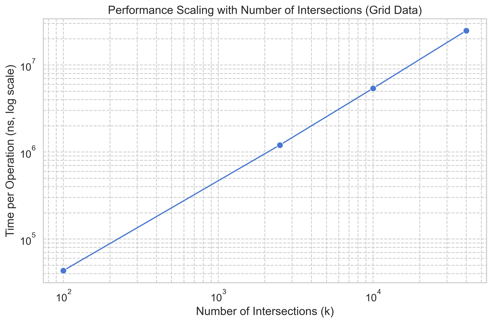

# benott

[](https://github.com/GregoryKogan/benott/actions)
[](https://codecov.io/gh/GregoryKogan/benott)
[](https://pkg.go.dev/github.com/GregoryKogan/benott)

A blazingly fast, production-ready Go implementation of the [Bentley-Ottmann](https://en.wikipedia.org/wiki/Bentley–Ottmann_algorithm) algorithm for counting line segment intersections.

## Overview

This library provides an efficient and robust solution for a classic computational geometry problem: finding the number of intersections in a set of 2D line segments. It uses a sweep-line algorithm powered by a Red-Black Tree for its status structure, ensuring optimal performance.

The implementation is carefully designed to handle complex edge cases, including vertical segments and multiple segments intersecting at a single point, making it suitable for demanding, production-level applications.

## Features

- **High Performance**: Achieves the optimal `O((n+k) log n)` time complexity, where `n` is the number of segments and `k` is the number of intersections.
- **Robust and Accurate**: Correctly handles edge cases like vertical lines, collinear points, and multiple segments intersecting at the same point.
- **Extensively Tested**: Near-perfect test coverage ensures reliability and correctness.
- **Simple API**: A single, clear entry point (`CountIntersections`) makes the library easy to integrate.
- **Memory Efficient**: Predictable, linear memory scaling with the number of input segments.

## Installation

```sh
go get github.com/GregoryKogan/benott
```

## Usage

Here is a simple example of how to use the library to count intersections.

```go
package main

import (
 "fmt"
 "github.com/GregoryKogan/benott"
)

func main() {
 // Define a set of line segments.
 segments := []benott.Segment{
  {P1: benott.Point{X: 0, Y: 0}, P2: benott.Point{X: 10, Y: 10}},
  {P1: benott.Point{X: 0, Y: 10}, P2: benott.Point{X: 10, Y: 0}},
  {P1: benott.Point{X: 5, Y: 0}, P2: benott.Point{X: 5, Y: 10}},
 }

 // Count the number of intersections.
 // For this "star" pattern, the 3 segments intersect at one point,
 // creating 3 unique intersection pairs: (s1,s2), (s1,s3), (s2,s3).
 intersections := benott.CountIntersections(segments)

 fmt.Printf("Found %d intersections.\n", intersections)
 // Output: Found 3 intersections.
}
```

## Performance

Benchmarks confirm the library's optimal `O((n+k) log n)` time complexity. The charts below show how the algorithm's runtime scales with the number of segments (`n`) and the number of intersections (`k`). The log-log scale helps visualize the near-linearithmic relationship.

*Benchmarks were run on an Apple M1 Pro.*

### Scaling with Number of Segments (`n`)

This test uses randomly generated segments, where `k` is sparse. The runtime scales predictably, demonstrating the `O(n log n)` characteristic.


### Scaling with Number of Intersections (`k`)

This test uses a grid of segments to generate a high number of intersections. The runtime scales nearly linearly with `k`, demonstrating the `O(k log n)` characteristic under high-contention scenarios.



| Benchmark                                                        | Operations | Time/Op      | Memory/Op    | Allocs/Op  |
| ---------------------------------------------------------------- | ---------- | ------------ | ------------ | ---------- |
| `BenchmarkRandomSegments/N=10`                                   | 226754     | 5113 ns/op   | 2578 B/op    | 45 allocs/op   |
| `BenchmarkRandomSegments/N=100`                                  | 14188      | 84862 ns/op  | 21938 B/op   | 340 allocs/op  |
| `BenchmarkRandomSegments/N=1000`                                 | 728        | 1623540 ns/op| 241283 B/op  | 3766 allocs/op |
| `BenchmarkRandomSegments/N=10000`                                | 45         | 26450798 ns/op| 2840804 B/op | 38514 allocs/op|
| `BenchmarkGridSegments/Grid=10x10_Segments=20_Intersections=100`   | 25434      | 46431 ns/op  | 20838 B/op   | 426 allocs/op  |
| `BenchmarkGridSegments/Grid=50x50_Segments=100_Intersections=2500` | 870        | 1337919 ns/op| 473002 B/op  | 10108 allocs/op|
| `BenchmarkGridSegments/Grid=100x100_Segments=200_Intersections=10000`| 202        | 5866263 ns/op| 1873693 B/op | 40216 allocs/op|
| `BenchmarkGridSegments/Grid=200x200_Segments=400_Intersections=40000`| 44         | 25497388 ns/op| 7442644 B/op | 160759 allocs/op|

The results show excellent, predictable scaling in line with the algorithm's optimal complexity.

## Contributing

Contributions are welcome! Please feel free to submit a pull request or open an issue for bugs, feature requests, or suggestions.

## License

This project is licensed under the MIT License. See the [LICENSE](LICENSE) file for details.

This project also includes third-party dependencies. Their licenses are collected in the [LICENSES-3RD-PARTY.md](LICENSES-3RD-PARTY.md) file.
